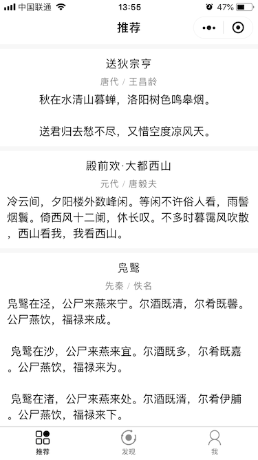
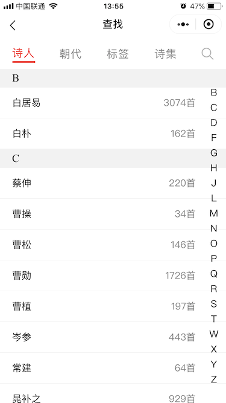
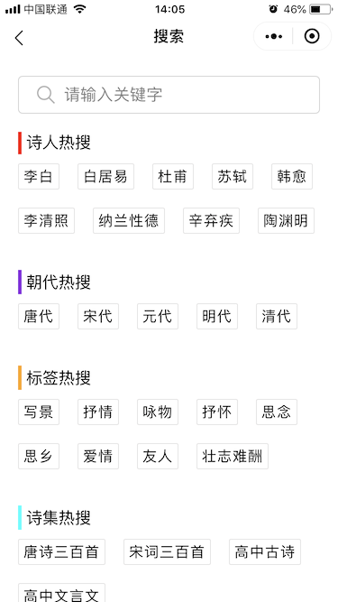

# WePoems

> 使用微信原生小程序框架来实现，并使用了腾讯云提供的云开发。

> ### 技术要点
>
> * 使用wx-for语法，展示诗词列表

> ### 技术要点
>
> * flex布局实现底部TabBar
> * 使用wx-if实现TabBar切换功能
> * Canvas图片生成

> ### 技术要点
>
> * flex布局实现顶部TabBar
> * 使用wx-if实现TabBar切换功能
> * 实现字母索引
> * 使用wx-for实现标签列表

> ### 技术要点
>
> * flex布局实现标签自动换行

> ### 技术要点
>
> * 使用云开发记录用户收藏的诗词记录

